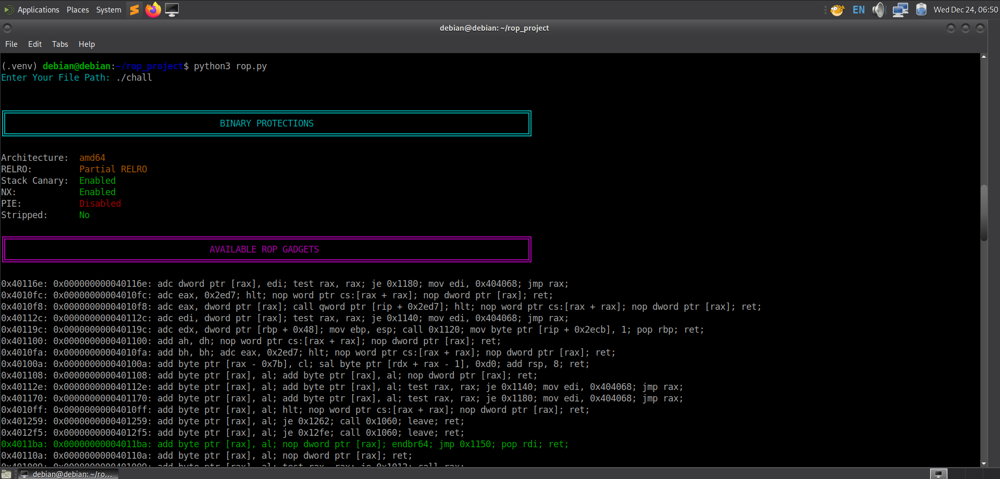

# RopCraft


RopCraft is a Python-based tool that automates binary exploitation analysis. It helps identify binary protections, extract ROP gadgets, and generate potential ROP chains using AI assistance. The project integrates pwntools, ropper, and the OpenAI API to aid exploit developers in analyzing ELF binaries and constructing ROP-based payload strategies efficiently.


## Overview


This project serves as a comprehensive ROP exploitation helper. It provides:
- Detailed binary protection information such as RELRO, Stack Canary, NX, PIE, and Stripped status.
- ROP gadget extraction using Ropper.
- Highlighted and color-coded gadget output for better readability.
- AI integration to automatically identify possible ROP chain combinations based on extracted gadgets and protection status.
- Well-structured terminal formatting with color-coded sections for clarity.


## Features


- **Binary Protection Analysis** – Gathers key ELF protection details automatically.
- **ROP Gadget Extraction** – Parses and lists useful gadgets from target binaries.
- **AI-Driven ROP Chain Generation** – Uses an LLM to analyze gadgets and produce practical exploitation sequences.
- **Colorized Output** – Uses colorama to present readable status reports and gadget lists.
- **Exploitation Technique Suggestions** – Can suggest chains for:
  - execve("/bin/sh") system calls
  - read and write syscalls
  - File operation chains (open/read/write)
  - SROP (Sigreturn Oriented Programming)
  - ret2libc and related methods


## Installation


i) Clone the repository:


```bash
git clone https://github.com/aditya-bhos04/RopCraft.git
cd RopCraft
```


ii) Create a virtual environment (recommended):


```bash
python3 -m venv .venv
source .venv/bin/activate  
```


iii) Install dependencies:


```bash
pip install -r requirements.txt
```


iv) Configure your OpenAI API key:


```bash
export OPENAI_API_KEY='<API-KEY>'
```

## Dependencies


Install these required Python packages before running the script:


```bash
pip install pwntools ropper colorama openai
```


Or use the provided `requirements.txt`:


```bash
pip install -r requirements.txt
```


## Usage


1. Run the script:


```bash
python3 rop.py
```


2. When prompted, provide the ELF binary path you wish to analyze.


The tool will:
- Print binary protection info.
- Extract and highlight useful ROP gadgets.
- Send the gadget list and protections to the integrated AI model for ROP chain construction.
- Display structured ROP chain outputs with short exploitation explanations.


## Customization


### Using Different AI Models


You can modify the AI model used for ROP chain analysis by editing the `model` parameter in the `ask_ai()` function:


```python
response = client.chat.completions.create(
    model="gpt-4o-mini",  # Change this to your preferred model
    messages=[...]
)
```


Supported models include `gpt-4`, `gpt-4-turbo`, `gpt-4o`, `gpt-4o-mini`, or any other OpenAI-compatible model.


### Customizing the AI Prompt


The prompt sent to the AI model can be modified in the `ask_ai()` function to suit your specific analysis needs. You can:
- Add custom exploitation techniques you want the AI to focus on
- Modify the output format requirements
- Include additional binary context or constraints
- Request specific types of ROP chains


Simply edit the prompt content in the `messages` parameter to customize the AI's analysis behavior.


## Example Workflow


1. User inputs ELF file path.
2. Tool prints protection details (RELRO, NX, PIE, etc.).
3. Extracted gadgets are displayed and color-highlighted (e.g., key pop gadgets and syscall gadgets).
4. The AI model generates possible ROP chains and brief exploitation steps.


### Sample Output


## How It Works


### Architecture Flow


```
User Input (Binary Path)
    ↓
ELF Analysis (pwntools)
    ↓
Protection Detection (RELRO, Canary, NX, PIE)
    ↓
Gadget Extraction (Ropper)
    ↓
Gadget Filtering (pop, call, ret, jmp, syscall)
    ↓
AI Analysis (OpenAI GPT-4o-mini)
    ↓
Formatted Output (Colorama)
```


## Technical Details


### Supported Architectures
- x86 (32-bit)
- x86-64 (64-bit)
- ARM


### Supported Binary Formats
- ELF (Linux) - Full support


### Dependencies Overview


| Package | Purpose |
|---------|---------|
| pwntools | Binary analysis and ELF parsing |
| ropper | ROP gadget extraction |
| colorama | Cross-platform colored terminal output |
| openai | AI-powered exploitation analysis |


## Contributing


Contributions are welcome! Feel free to:
- Report bugs
- Suggest new features
- Submit pull requests
- Improve documentation


## Author


- GitHub: [@aditya-bhos04](https://github.com/aditya-bhos04)
- LinkedIn: [aditya-bhos-967815250](https://in.linkedin.com/in/aditya-bhos-967815250)


## Acknowledgments


- [pwntools](https://github.com/Gallopsled/pwntools) - CTF framework
- [Ropper](https://github.com/sashs/Ropper) - ROP gadget finder
- [OpenAI](https://openai.com/) - AI capabilities
- [Colorama](https://github.com/tartley/colorama) - Terminal colors


---


If you find this project helpful, please consider giving it a star on GitHub.
